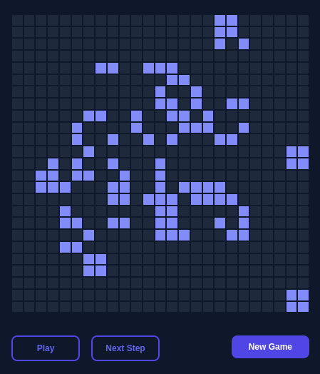

# Game of Life

An app where users can watch, cycle through, and generate variations of [Conway's Game of Life](https://en.wikipedia.org/wiki/Conway%27s_Game_of_Life).

[View the app on Netlify](https://dcwds-gameoflife.netlify.app)

[](https://app.netlify.com/sites/dcwds-gameoflife/deploys)

[](https://dcwds-gameoflife.netlify.app)

## Rules

- Any live cell with fewer than two live neighbours dies, as if caused by under-population.
- Any live cell with two or three live neighbours lives on to the next generation.
- Any live cell with more than three live neighbours dies, as if by overcrowding.
- Any dead cell with exactly three live neighbours becomes a live cell, as if by reproduction.

[_You can check out the algorithm I implemented using these rules._](src/algo/gol.js)

## What I Learned

- [Jest has a `useFakeTimers` method](https://jestjs.io/docs/timer-mocks) which makes [testing `setInterval` easy](src/components/app/app.test.js).
- Breaking up the algorithm logic into [multiple functions](src/algo/gol.js) makes [testing it easier](src/algo/gol.test.js).
- Tailwind continues to be a clear winner in terms of getting something decent-looking out quickly.
- Use [GitHub workflows](.github/workflows/on-pull-request.yml) to gain more confidence in deployments.

## Tech Stack

- Bootstrapped with [Create React App](https://createreactapp.dev)
- Styles with [Tailwind](https://tailwindcss.com)
- Testing tools with [Testing Library](https://testing-library.com)

## Usage

```sh
# Install dependencies
$ npm install

# Start dev server at localhost:3000
$ npm start

# Build for prod
$ npm run build

# Start test runner
$ npm test
```
